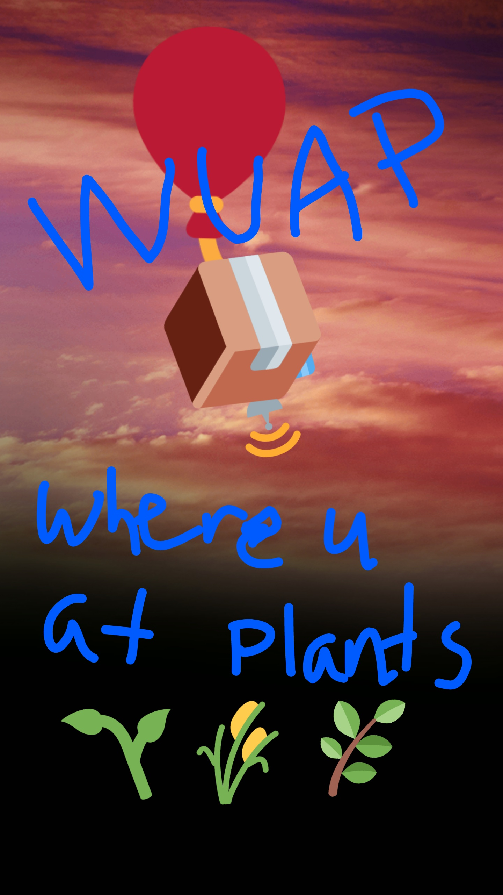

# Where U At Plants? (WUAP): Capturing and Masking Images from Raspberry Pi 3 + Pi Camera
![Built for RIT Space Exploration](https://img.shields.io/badge/Built%20for-RIT%20Space%20Exploration-orange.svg?style=for-the-badge&logo=image%2Fpng%3Bbase64%2CiVBORw0KGgoAAAANSUhEUgAAAA4AAAAOCAYAAAAfSC3RAAACrklEQVR42i2PfUzMcRzH37%2Brc%2B4iPdzTlFy5y9UlYURirlyF1HSHRS1UaDWyNRFt1oOH9eAPUsrKwy2TWA7jOoXZhDo1MzT9UW2t%2B4d%2FMJvV3s5v%2Fvh%2B997n%2B3599vpiuRawWwHHTsBmROS5TTjrsmG0pXz3t6tl1ulnNrirNqIiJRw6ewbQkg7oAgARbN0O9O9B3sdD%2BH0vU84EtZwPe1%2Bxq8fJDUpvtso5UoBvD2zIqrMA4YEAopRApxV7fpYLzDapCRgJ6KnV6KlWLyHw70Rxf5yav04IbE7HNu08AHFaRA%2BX4EdShEYsSKUGCsICWiypTE5OITCfvr4GAtHcEa3iSLHgWeyPMFzYgvrWLD8Ckd6C3guGE%2FDjnTud7OhoF7MghFEiiRA7120KnjajAs%2FzheGsKI2oJ5PpCSio1S7h4OBb9vX3MSjon6q%2Fd6FONMqOUdKZh5fozZV4YjWh%2F0EjAR9aM7bSMzHKsS%2BfuNmcJM5kskjx%2F%2BtDQ%2FlkrzAFV65kcvXCEFFDEIIJiZL25oucGHnB8aE%2BXqqpJBBIiaAVO8nhoXTmSsbh2ie49q9UixoAGLM2jd9HX%2FC9o5Ufei7T437KRcsSxTfAxKJ4FR%2FlCg4cS0Sxq0BBIJjwXcXLjQ3k6yoOdDVy8G4dOVDL6upaEQJU7Cucy8PxyIPUBwH9efh6JUXBfQcrOdOezJnuw3xjP8N3t2s4232Av9q2MmtXGa%2BlyujMgdvLyAEAqWFYMXFcNs1bKv4pBYccbZyqX82pS2a67zdx9ijITg0%2FH5FOJmhgFCHFHCAtArDoYKgzo3e8VE5PbRx5CmSFwMmqOI6VSHnejCcbFiEiMQSYKwUg917ZJiA2GMg3wf%2FkOsFSZETTzXQ8vrENjsKlaChbIzHnGDHfEABk6gGZL%2FAX6Ic40MKT0QEAAAAASUVORK5CYII%3D)![Powered by Python3 + OpenCV](https://img.shields.io/badge/Powered%20by-Python%203%20%2B%20OpenCV-blue.svg?style=for-the-badge&logo=image%2Fpng%3Bbase64%2CiVBORw0KGgoAAAANSUhEUgAAAA4AAAAOCAMAAAAolt3jAAABUFBMVEUAAAArgKo4erI4ea83d603dqo3dKc3c6ZVVao5e7E4ebA2d603cKE3ea83d603dqo3bp02d7M3ebA4d6w2dqs2dKc2cqU3caJRe4%2F%2F2En%2F1Uf%2F%2F4A3erE4ea9riIT%2F0kE4ea%2BKmHX%2F0T83d603caI3caA3bp42bZo2a5g7bZT90kX%2Fzj43dqo4c6L931L%2F3U3%2F20z%2F2kr%2F10f%2F1UX%2FzDw3c6ezs2%2F%2FzDo4c6bNw1%2F%2FyDc2cKA4bZzlzVb%2F00P%2F0EL%2Fzj7%2FzDz%2FzDn%2FyDf%2F2Ur%2Fzz3%2Fzjz%2Fyzn%2F1kb%2FzTz%2Fyzr%2FyDf%2F%2FwD%2F1EL%2F0EH%2Fzz%2F%2FzTz%2FyTj%2Fv0A3dqo3dKc3c6U3caI3cKA3bp03d602bZr%2F1kf%2F1EU2a5j%2F0kL%2F0kP%2F0ED%2F00P%2F0UD%2Fzj7%2F3U7%2F20z%2F2Ur%2F10f%2F1UX%2Fzz7%2FzTz%2F0UH%2Fyzr%2F10j%2Fzz%2F%2F%2F%2F%2BP0EkTAAAAU3RSTlMABo7e%2BffZfgNVp3pUXe7gay9hcoiIiPp0d1YCXP5%2BfdBv4fXizMzMxnqf%2FvakecnMzMzl%2FtRu2m17Ykt3a4qIiGpVLl3g6GtFiZ5hAXDQ8POECIMytFgAAACFSURBVAgdBcGxSgNRFAXAM3svJm87W%2FEHbNILBlKk8IsFO0EQOzsRe9vU7i6IM5IA%2FCadZM8jnpJ0kgY6iVwDJy%2FoWw8rmK6OXrvvVzBVmapr5QOMMnrwNYMDowfjAIud6qJgmf9M1e%2Bl7bZP8CbJ%2BW5b5m%2Bek07S2zJXk6ST9I%2BLy40k%2FyI8GeLut5gTAAAAAElFTkSuQmCC)

Where U At Plants? (WUAP) is a high-altitude balloon payload used to gather aerial image data for future vegetation density analysis. WUAP uses on-board image processing with a Raspberry Pi 3, Python 3 and OpenCV 3.3 to mask RGB images of the Earth and attempts to mask areas of high vegetation using colorspace transformations.

This project is the first of many SPEX experiments with on-board image processing and computer vision on high-altitude balloons and space systems.

## Additional documentation
* For overarching goals and long-term visions for future work, please read the [**Project Definition Document**](reports/Project%20Definition%20Document/hab-cv.pdf).
* This payload flew aboard HAB4 on April 22, 2018. Read the [**HAB4 Post Flight Report**](reports/HAB4%20Post%20Flight%20Report/report_wuap_posdtflight-hab4.md) for details.


## What does it do?
This script starts a video stream, samples "raw" video frames and saves them with single frame compression, and generates a binary mask according to an HSL color range and saves the mask corresponding to each video frame with single frame compression.

## That's it?
This project is driven by the objective to estimate vegetation density from imagery captured from a high altitude balloon.
The code and methods here describe only a portion of the development required for any sort of high-fidelity or real-time vegetation density mapping, but make up the basis for future work.

First and foremost, this project aims to _collect data_ in the form of as many images (visible and near-infrared) of the Earth as possible.
More advanced analysis can be performed later on the ground, and more time can be spent developing and testing new algorithms for future flights.

While on-board processing is a secondary objective, we aim to demonstrate its usefulness with simple image processing algorithms performed in-flight.

# Approach
On the main thread, values are initialized and 3 threads are opened to capture, process, and save image frames concurrently.
Data is passed between threads using a queue.

1. Using `PiVideoStream` from the [`imutils`](https://github.com/jrosebr1/imutils) library, a threaded video stream is opened to continuously capture frames from the camera module at the specified image size and framerate (640 x 480 @ 60 fps).

2. A thread is opened to read and save frames from the video stream as fast as possible.
Each iteration of the looped read process, the most recent frame of the continuous stream (Thread 1) is sampled and saved as a JPEG image.
The frame (a 640 x 480 x 3 numpy array) and its label (`time.time()` as a formatted string) are pushed to a queue as a tuple.

3. A thread is opened to pop frames from the queue, apply a color mask and save that mask as fast as possible.
Each iteration of the looped mask process, the first tuple of the FIFO queue (frame array and its name) is popped from the queue.
The frame colorspace is converted to hue-saturation-lightness (HSL) and a pixel-wise binary mask is generated.
Any pixel within the given tunable HSL value range is given a value of 1, all other pixels are given a value of 0.
The binary mask is saved as a JPEG image.
(To improve speed, the frame may be resized. However, in testing the `resize -> mask -> save` process was the same speed or slower than a full-frame `mask -> save` process.)

In desktop testing, the all threads run continuously until the user provides input.
After user input is given, the video stream and read processes are stopped.
The mask process finishes working on the remaining frames in the queue then is stopped.

In flight, all threads run continuously until the system runs out of power or memory is full.
If either of these conditions are reached, the script obviously is halted and does not gracefully exit but all frames until that point would have been saved - but the masking thread will likely be hopelessly behind the capture thread in terms of processing.

# Using the Code

## Requirements & Dependencies
Raspberry Pi 3 Model B + Raspbian Stretch Lite (OS),
Raspberry Pi Camera Module v2 (or Pi Camera NoIR v2)
```shell
git clone hab-cv
cd hab-cv
```

### Using OpenCV
```shell
cd installer
sudo chmod +x installer.sh bootintowuap.sh
sudo ./installer.sh
sudo reboot
```
For help installing OpenCV 3.3.x to a Raspberry Pi with Raspbian Stretch, consult [this great tutorial from PyImageSearch.com](https://www.pyimagesearch.com/2017/09/04/raspbian-stretch-install-opencv-3-python-on-your-raspberry-pi/).

### Using scikit-image
[`scikit-image`](http://scikit-image.org/) is a Python module with many handy image processing tools built upon NumPy and SciPy.
It is much easier to install on a Raspberry Pi, but is not as feature-complete as OpenCV.
```shell
cd installer-sk
sudo chmod +x installer_sk.sh bootintowuap_sk.sh
sudo ./installer_sk.sh
sudo reboot
```
Since future flights are planned to use more advanced image processing and computer vision techniques, it is **recommended to install OpenCV instead of scikit-image**.
However, the primary objective of WUAP is to obtain a large collection of images for future CV experiments, so it may be more reliable to install scikit-image for this payload only.
Future development will only support OpenCV.


## Running the Script
With OpenCV
```shell
python3 wuap.py
```
With scikit-image
```shell
python3 wuap_sk.py
```

Each raw video frame is saved in the `raw` folder.
Each corresponding mask is saved in the `mask` folder.

Press any key then Enter to close the video stream and stop all processes.
The masking process will mask the remaining frames in the queue before closing.

## Starting WUAP at bootup
A shell script is included in this repository to enable `wuap.py` to be executed at boot (as a service). 
Running WUAP at boot **will not** output information to the terminal while it is running, and will not block other operations.

```shell
sudo chmod +x bootintowuap.sh
sudo ./bootintowuap.sh
```
The example code above is shown using OpenCV mode, but the same instructions can be applied to scikit-image mode.

Stop the WUAP service with the following command:
```shell
sudo systemctl stop wuap.service
```

## Infrared Mode
The filters for the infrared camera can be tuned differently from the regular picamera.
To start WUAP in "infrared mode," use the `-ir` option.
```shell
python3 wuap.py -ir
```
To boot into infrared mode, run the alternative shell script included in the installer directory.
```shell
sudo chmod +x bootintowuap-ir.sh
sudo ./bootintowuap-ir.sh
```
The example code above is shown using OpenCV mode, but the same instructions can be applied to scikit-image mode.

# Basis for Experiment
Vegetation is identified two ways: Identification by color from visible-light images, and using the Normalized Vegetation Density Index from vilisble-light and near-infrared images.

## Identification by Color
_This is the image processing algorithm executed in-flight._

Plants are (mostly) green. Roads, buildings, and bodies of water (mostly) aren't.
This is the core principle for identifying vegetation from RGB aerial imagery.
While it is difficult to judge vegetation _density_ this way, it is fairly simple to identify vegetation from inorganic structures and generate a binary mask.

Thanks to chlorophyll and natural selection, plants come in a variety greenish colors.
To account for different brightnesses and a range of yellow-greens to blue-greens.
We can extend the acceptable range to some browns as well.
By changing our image colorspace from Red-Green-Blue (RGB) as captured by the picamera, to Hue-Lightness-Saturation (HLS) we can limit our mask's accepted _hue_ range while leaving _lightness_ and _saturation_ to allow wide ranges, thus allowing light blue greens to dark yellow greens all to register as vegetation.

For now, we visually tweak these ranges using [past flight video from HAB2](https://youtu.be/U40UZp3Z3a4?t=71), but in the future it is reasonable to assume another algoritm might be used for this calibration.
Not all plants are green, and not all green areas are vegetation. Despite this, initial testing demonstrates that a simple HSL masking of aerial imagery yields decent results.


An alternative to the HSL colorspace is Hue-Saturation-Value (HSV).
HSV is similar to HSL in dividing the spectrum, but with less distict separation of black and white in the colorspace.
The [Wikipedia article on HSL and HSV](https://en.wikipedia.org/wiki/HSL_and_HSV) provides great insight into the construction of the two colorspaces and their distinctions.

HSV is used in the same way as HSL, the difference being the values of the color filter.
The primary benefit to using HSV over HSL is that many tools, such as scikit-image, have readily available RGB-to-HSV colorspace transformations, but not many have RGB-to-HSL transformations.

## Normalized Vegetation Density Index (NDVI)
_This is an algorithm which will be used on future flights._

A more precise method of measuring vegetation density is through spectroscopy.
To the naked eye, we see the reflected wavelengths of green that chlorophyll in vegetation reflects.
However, plants respond quite strikingly in the infrared portion of the spectrum as well.

> The pigment in plant leaves, chlorophyll, strongly absorbs visible light (from 0.4 to 0.7 µm) for use in photosynthesis. The cell structure of the leaves, on the other hand, strongly reflects near-infrared light (from 0.7 to 1.1 µm). The more leaves a plant has, the more these wavelengths of light are affected, respectively. [[1]](https://earthobservatory.nasa.gov/Features/MeasuringVegetation/measuring_vegetation_2.php)

A well-established method of measuring vegetation density has arisen from this facet of nature called the Normalized Vegetation Density Index (NDVI).
NDVI normalizes the infrared response of regions on the earth to their response in the visible range.
This effectively transforms the imaged region to show areas where visible light is strongly absorbed and infrared light is strongly reflected.

```
Let
    NIR = near-infrared wavelength response (0.7-1.1 micron)
    VIS = visible wavelength response (0.4-0.7 micron)

Such that
    NDVI = (NIR - VIS)/(NIR + VIS)
```

NDVI is effective in rejecting man-made structures, water, and land features since these types of regions rarely strongly absorb visible AND strongly reflect infrared (usually its one or the other, not both).


> Public Lab demonstrates how applying a clever colormap to NDVI data makes identifying vegetation very clear against the background. [[2]](https://publiclab.org/notes/khufkens/05-10-2015/multispectral-raspberry-pi-first-light-ndvi-images)

- [1] https://earthobservatory.nasa.gov/Features/MeasuringVegetation/measuring_vegetation_2.php
- [2] https://publiclab.org/notes/khufkens/05-10-2015/multispectral-raspberry-pi-first-light-ndvi-images


