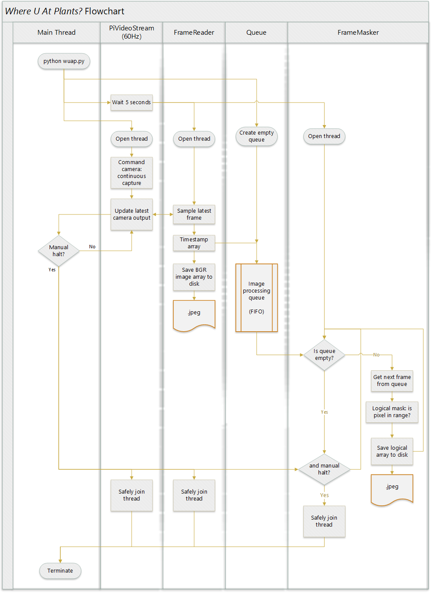

# Where U At Plants (WUAP) Technical Report
Philip Linden

May 2, 2018

## Abstract
[abstract goes here]

## Introduction
*Where U At Plants?* (WUAP) is a high-altitude balloon payload used to gather aerial image data for future vegetation density analysis.
WUAP uses on-board image processing with a Raspberry Pi 3, Python 3 and OpenCV 3.3 to mask RGB images of the Earth and attempts to mask areas of high vegetation using colorspace transformations.
This project is the first of many SPEX experiments with on-board image processing and computer vision on high-altitude balloons and space systems, whose objectives are to demonstrate these technologies to do science and push the limits of lightweight, low-cost hardware.

The science objective of mapping vegetation density is not driven by a particular scientist or research criteria.
Rather, it presents a straightforward problem and fertile testbed for developing a variety of key technologies and capabilities that the participants and contributors are interested in.
WUAP is as much of a technology demonstrator as it is a learning platform and engineering sandbox for student and alumni members of RIT Space Exploration to gain experience designing, integrating, and analyzing data from real-world systems.

## Objectives
The primary objective of WUAP was to collect a large dataset of ground-facing images from a Raspberry Pi Camera module paired with high altitude balloon sensor data.
A large dataset like this will enable future explorations of image processing components of future remote sensing experiments, including (but not limited to) deep learning techniques.
It is important to consider the specific camera being used, Raspberry Pi Camera module, as it is a low cost, easily integrated component. Rather than characterizing the sensor's performance in a laboratory setting, WUAP was intended to gather a "functional baseline."

A secondary objective was to demonstrate on-board processing during data collection. As part of the science goal to map vegetation density, a simple binary mask was generated using the RGB data to reject areas of the image that are not likely to be plants (i.e. not green in color).

The last objective of the mission was to provide the capability to determine a "ground truth" of vegetation density during post-flight processing using the method of Normalized Vegetation Density Index (NDVI).
NDVI is a method where the visible reflectance from plants (0.4-0.7 micron) and the near-infrared reflectance from plants (0.7-1.1 micron) are used to normalize an image, assuming healthy plants reflect much more visible light than infrared light.
By collecting near-infrared light for the same scene as the visible light images, the effectiveness on-board processing mask can be assessed and a confident baseline can be established.

## Payload Hardware
The WUAP experiment uses a pair of Raspberry Pi 3 B+ single-board-computers (SBC) for commanding the camera modules, saving images, and on-board image processing.
The SBCs are powered by a lithium polymer battery.
Each SBC interfaces with a Raspberry Pi Camera Module V2.
The SBCs and camera modules are housed in an ABS enclosure mounted to the Earth-facing side of the HAB.

Pi Camera Modules are [Sony IMX219PQ](https://www.sony-semicon.co.jp/products_en/new_pro/april_2014/imx219_e.html) visible RGB detectors with small lenses.
While the detector is sensitive to light into the near-infrared, the standard camera module has an infrared filter installed to restrict the spectral response to approximately 400-700 nm.
To detect near-infrared light, Raspberry Pi Camera NoIR Module is available, which is an identical sensor and optics sans filter.
The red channel of the NoIR module is sensitive to approximately 1200 nm.

| Sony IMX219PQ | [(source 1)](https://elinux.org/Rpi_Camera_Module#Technical_Parameters_.28v.2_board.29) [(source 2)](https://www.sony-semicon.co.jp/products_en/new_pro/april_2014/imx219_e.html#Table2) |
| --- | --- |
| Sensor Type | 3-color (RGB) CMOS |
| Pixel Size | 1.12 x 1.12 micron |
| Array Size | 3280 x 2464 (active pixels) 3296 x 2512 (total pixels) |
| Lens Focal Length | 3.04 mm |
| Lens F-Number | f/2.0 |
| Angle of View | 62.2 x 48.8 degrees (Full-frame SLR lens equivalent: 29 mm) |
| Framerate | 60-90fps @ 640x480, 4x4 binning (up to 120fps with overclock) |
| Spectral Response | [Reference](http://www.khufkens.com/projects/ov5647-spectral-response/) |

### Integration Issues
A contributing factor in the decision to use almost entirely commercial off-the-shelf (COTS) components is not only their cost, but also their simplicity to use and enormous amount of freely available documentation.
The WUAP payload concept and software was developed completely remotely from RIT Space Exploration Mission Control, where the payload components were assembled and integrated.
While COTS components made it easy to test the payload remotely by buying the same products, the physical separation between payload and HAB integration teams posed new challenges, and is partly responsible for some of the issues encountered during integration.

The NDVI objective was aborted during integration when two days before flight it was discovered that the NoIR camera module purchased by the team included a different lens configuration than the standard Pi Camera V2 and Pi Camera NoIR modules.
This was a procurement (and communication) error, and it was decided by the HAB launch team to install a second visible (filtered) Pi Camera V2 module rather than a NoIR module since ordering a replacement part would delay the launch.
For this reason, no data was collected in the near-infrared spectrum for any imagery during the HAB4 flight.

## Payload Software
Python 3 was used to capture, save, and process images during flight.
Python is easy to implement and easy to read, making development and debugging fast.
Execution of Python code for image processing is not as fast as a C++ implementation might be, but the team decided to trade development efficiency for execution efficiency.
Future iterations of flight software for computer vision and imaging payloads might use Python or C++, subject to another similar trade since almost all third party libraries used for WUAP are also available in C++.

Interfacing with the camera modules was handled by the open source [PiCamera](http://picamera.readthedocs.io/en/release-1.10/fov.html#camera-modes) library.
[OpenCV 3.3.1](https://docs.opencv.org/3.3.1/d0/de3/tutorial_py_intro.html) was used to handle and process images.
An implementation of WUAP was written in [scikit-image](http://scikit-image.org/) due to its easier installation process, but only the OpenCV version of WUAP code was used during flight.
OpenCV was chosen because of its straightforward image processing tools and because future computer vision processes could make use of OpenCV's extensive toolset.

The WUAP Python script runs as a service upon startup of the SBCs so the software starts on launch day without user input.
First the script runs a system checkout, cycling through the entire processing loop step by step to check for software, hardware, or interfacing issues that might prevent the code from operating properly.
This sequence takes approximately 10 seconds and upon completion, all processes are restarted in open loop mode where the script runs continuously until receiving user input or the battery runs out of power.

### PiVideoStream
Camera commanding, capture and image file saving, and masking perations are delegated to three separate threads so that they can run asynchronously at the maximum rate without blocking each other.
The camera module is commanded in the `PiVideoStream` thread to run in continuous mode at 640 x 480 resolution and 60 frames per second.
This resolution was chosen because it is the largest image resolution for which the `picamera` Python library can drive the sensor at or above 60Hz.[<ref>](http://picamera.readthedocs.io/en/release-1.10/fov.html#camera-modes)
This mode captures images from the full field-of-view (FoV) of the 2592 x 1944 pixel sensor, using 4x4 pixel [binning](http://www.andor.com/learning-academy/ccd-binning-what-does-binning-mean) to achieve the final resolution of 640 x 480.
Images are read from the sensor in RGB format but OpenCV operates under the BGR regime, so color channels are mapped appropriately.
The video stream operation was executed on a separate thread to ensure the framerate is locked at 60Hz.

### FrameReader
The image saving operation was executed on a new `FrameReader` thread, which samples `PiVideoStream` at an unlocked framerate which is only limited by the speed at which the SBC can save image arrays to disk as `.jpg` files.
The sampled image is the last frame captured by the video stream thread.
Images are named based on the time at which they are saved using Python `time.time()`, which returns the time in seconds since the epoch (UTC) to nanosecond precision.
The method `time.time()` depends on the accuracy of the system clock, in this case only non-decreasing, unique values are desired.
After saving, the image data is placed in a queue for processing.
The saving operation was executed on a separate thread so that it did not block the video stream operations in case saving to disk took too much time and would delay subsequent frames.

Since the `FrameReader` thread runs at an unlocked framerate, it may sample images faster or slower than the video stream can update.
If it samples faster than 60Hz, duplicate images are saved to disk, wasting storage space with redundant data.
If it samples slower than 60Hz, some intermediate frames captured by the video stream are lost and not saved.
The consequences of this design choice are discussed in a later section.

### FrameMasker
The on-board image processing objective is satisfied by doing basic operations on saved images during flight.
Primitive vegetation identification is implemented by creating a logical mask where pixels in a specified value range are registered as `true` while all other pixels are registered as `false`.
The acceptable color range for vegetation (e.g. colors similar to browns and greens) is most easily defined using the Hue-Saturation-Lightness (HSL) colorspace as opposed to RGB.
Once again, OpenCV defines the common order for color channels and implements HLS (hue-lightness-saturation).
The BGR image is transposed to HLS colorspace using OpenCV [`cvtColor()`](https://docs.opencv.org/3.1.0/de/d25/imgproc_color_conversions.html) and a 2D logical mask is generated using OpenCV `inRange()`, where a pixel's value must be within the range of all three channels to register as `true`.
The tuning method for this filter and other pre-flight testing is described in the next section.

| Channel | Minimum (0-255) | Maximum (0-255) |
| --- | --- | --- |
| Hue | 35 | 120 |
| Lightness | 5 | 140 |
| Saturation | 35 | 255 |

<!--

| Min - - - - - - - - - - - - - - - - - - - - - - - - - -  Max |
-->

Images are retrieved from the queue, masked, and the mask is saved to disk.
The while these operations execute at an unlocked rate, masking operation takes much longer than 16ms so a framerate of 60Hz is not at all feasible with this method.
The `FrameMasker` operates on yet another separate thread so as to not block the operations of `PiVideoStream` or `FrameReader` threads.

## Limitations
The chosen WUAP software implementation method has some significant drawbacks, especially for future experiments where more processing may be desired.
Asynchronous processing and capture is a good approach for ensuring that raw image capturing does not get held back by slower image processing operations.
However, since the two threads operate at different rates, the slower thread lags behind and the processing queue grows linearly with time, and can quickly get out of hand.
Similar issues arise when the video stream and image saving threads run at significantly different rates.

The largest drawback to this implementation is the lack of synchonization between the two WUAP Raspberry Pi SBCs.
Each SBC operates independently during flight.
The only timing synchronization between the two is when they are powered on, since both computers are powered by the same battery pack.
While the software may take a similar amount of time to startup and the WUAP scripts may run at similar rates for the two boards, there is absolutely no way to relate the timing between images captured on one board to images captured on another besides the timestamp in the image's name.
Linking image capture timing, or at least having a consistent timing baseline, becomes critical when comparing imagery from the two boards at a given time, since the motion of the entire HAB vehicle may change at significant rates.

## Pre-Flight Testing
All testing and development of WUAP software was conducted on a "twin" setup remotely in Santa Clara, California.
WUAP's "twin" consisted of a Raspberry Pi 3 B+ and Pi Camera V2 Modules just like the components used in flight hardware.

Tuning the color range of the mask is critical for producing accurate results.
During development, the color range was tuned using images from previous HAB flights (HAB1) and Google Earth images.
In both cases, the color mask operation was executed outside of WUAP's main codebase and operated on video screen captures on a desktop PC running Windows 10.
HAB1 took flight on October 25th, 2015 during overcast and rainy weather, and Google Earth data is a composite from many different days and conditions.
Neither of these were representative of the clear, April day of HAB4's flight.
No additional tuning to the color range was conducted prior to the HAB4 flight.

Despite plans to do so, no benchmarking or performance baselines were established prior to the HAB4 flight.
The performance impact of image processing during frame captures is unknown.
The impact of different temperature, pressure, and humidity conditions on performance are unknown.
No characterizations of image quality, optical distortions, sensor noise or sensor responsivity were obtained prior to flight.

Some of the main reasons for the significant lack of testing were limitations of time and resources.
WUAP was developed and integrated by RIT Space Exploration student and alumni members in their free time and across the country.
No laboratory or testing equipment was available to the development team.

## Flight Profile
Where U At Plants (WUAP) flew as a payload on RIT Space Exploration's high altitude balloon [HAB4 mission](http://spex.rit.edu/rit-spex-launches-hab-4/) on April 22, 2018.
HAB4 launched from RIT at 10:24am EST and landed 2 hours 5 minutes later outside Hector, NY.
Image data was retrieved from the Raspberry Pi SD memory cards after recovery.

| | Camera 1 | Camera 2 |
| --- | --- | --- |
| BGR images saved | 12,026 | 31,751 |
| Logical masks saved | 18,297 | 31,745 |

{side by side sample earth image and corresponding mask}

Additional flight data was recorded by HAB4's primary avionics board using a [BME280](https://www.embeddedadventures.com/datasheets/BME280.pdf) sensor.

| | |
| --- | --- |
| Average ascent rate | 907 feet/min |
| Maximum altitude | 81,916 feet |
| Balloon burst | 89.4 minutes after launch |
| Average descent rate | 2,242 feet/min |
| Balloon landed | 125.8 minutes after launch (36.4 minutes after burst) |
| Minimum temperature | -27.66 C |
| Maximum temperature | 18.48 C |
| Minimum relative humidity | 2.91% |
| Maximum relative humidity | 70.60% |

After recovery, the flight WUAP camera enclosure was fractured, but both SBCs, cameras, and memory cards remain intact and functional.

## Post-Flight Analysis
Operationally, WUAP was a success. The payload module turned on both SBCs, which saved visible Earth images and logical masks from launch until the end of flight.
All saved images were recovered successfully from the SBC memory cards.
Unfortunately this is where the successes end for this flight.

The primary objective of obtaining a large dataset of Earth-facing images was successful, but the quality of the dataset is much worse than anticipated.
The dataset was expected to be equivalent to video at 60 frames per second.
While duplicate frames (FramReader sampling faster than the video stream updates) and skipped frames (FrameReader sampling slower than the video stream updates) were expected, the effective delta between real video frames was expected to remain at a constant rate.
However, the observed images appear to show both of these issues happening at once.
It appears that the cameras very slow video stream framerate of multiple seconds between video frames *and* a FrameReader sampling rate that was faster than the video stream framerate.
This behavior was not observed pre-flight during software testing on the development boards in California.

This anomaly is unlikely to be linked to hardware limitations of the sensor or camera module, which is rated to more than 60fps at 640x480 resolution using the PiCamera Python interface.[(source)](http://picamera.readthedocs.io/en/release-1.10/fov.html#camera-modes)
Past SPEX HAB flights experienced issues using GoPro cameras that are thought to be linked to the temperature extremes experienced in layers of the upper atmosphere during flight, but since the issue on WUAP was observed from launch at sea level, significant effects from environmental factors are unlikely.
A more likely explanation is that the SBCs processors were strained from operating a video stream, writing data to disk, which either led to a lack of processing resources or the SBCs strained their power supply and the computers were unable to pull sufficient current to operate at full speed.

The secondary objective to demonstrate on-board processing and primitive vegetation mapping was successful from a technical demonstration, but completely ineffective in terms of the resultant masks.

The effectiveness of the HSL color masks is directly related to the effort that was put into tuning the color filters.
It is true that the color profile of vegetation on the ground is highly variable with plant species, density, health, and also with weather and seasonal conditions.
It is feasible to expect the color filter to be able to pass a majority of vegetated areas (forests, farms, yards) and reject clearly artificial areas (buildings, roads) if the filter is calibrated near to the time of the launch itself.
However, the color filter was manually tuned using Google Maps images and flight images from HAB1 flight in October 2015.

### Lessons Learned
The WUAP payload suffered from a considerable lack of testing.
Many of the issues encountered in the resulting dataset were preventable given enough pre-flight testing and calibration.
Additionally, troubleshooting these issues is much more difficult since there was no baseline performance benchmark to compare against.
While the constituent parts of the WUAP payload were conceptually well understood, real systems behave in unexpected ways and it is very important to understand the *real* system when developing payloads for flight.
This includes developing engineering tools that are not used on the payload itself, but rather allow the payload to be well understood in terms of its behavior and performance.

### Future Work
Beyond troubleshooting and examining WUAP images and masks, good science and interesting insights can be gleaned from the existing dataset, especially combined with flight data collected from other sensors and cameras on HAB4.
- Build a model of camera field of view and projected area observed using IMU and APRS flight data, then superimpose WUAP imagery on a map.
- Combine projected imagery with public data on geographic topography and vegetation density.
- Develop a method to identify areas of vegetation and map vegetation density using only visible RGB imagery.
- Document and publish the results.

## WUAP2
If WUAP is selected to fly again on a future RIT SPEX HAB flight, some improvements should be made to the payload in addition to testing and tuning for WUAP2.
Without any changes to the design scope, near-infrared imagery could be collected by including a Raspberry Pi Camera NoIR module.
Moreover, the risk of dropped or skipped frames could be resolved by placing video stream frames in a queue much like how the processing queue currently operates.

Expanding the design scope, it would be advantageous to establish some sort of synchrony to images from the two cameras.
Keeping the architecture using two SBCs, if there was communication between them the image captures could be synchronized.
A more complicated approach might allow shared processing power between multiple SBCs, perhaps where one SBC handles image capturing and another SBC is solely used for processing.

Lastly, the architecture of using two SBCs with one camera per SBC was chosen purely because it was easy to start developing the payload using a Raspberry Pi and a Pi Camera module, and Raspberry Pis only have one camera interface on the board.
USB cameras are inexpensive and widely available, and Raspberry Pis (and other SBC types) have multiple USB ports.
It makes sense to explore using multiple cameras with a single SBC, which solves the issue of synchronizing image captures, but limits available processing power even further.